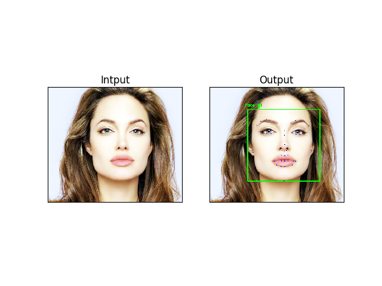

# Facial Landmark Detection 

# Overview
In this demo we will find the facial landmarks, such as eyes, nose, mouth, ears, jaw-line using the popular [dlib](http://dlib.net/) library


# Dependencies
```pip install -r requirements.txt```

You also need shape detector, you can download it by 
```
wget http://dlib.net/files/shape_predictor_68_face_landmarks.dat.bz2
```
# Usage
 ```
 python facelandmarkdetect.py --shape-predictor shape_predictor_68_face_landmarks.dat --image images/face1.jpg
```
### Results



### Reference
[One Millisecond Face Alignment with an Ensemble of Regression Trees, Kazemi and Sullivan (2014).](https://pdfs.semanticscholar.org/d78b/6a5b0dcaa81b1faea5fb0000045a62513567.pdf)


Credits: My Guru: Adrian Rosebrock 
